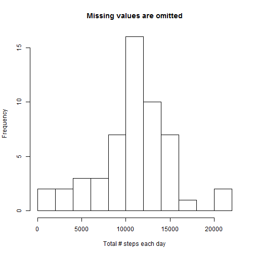
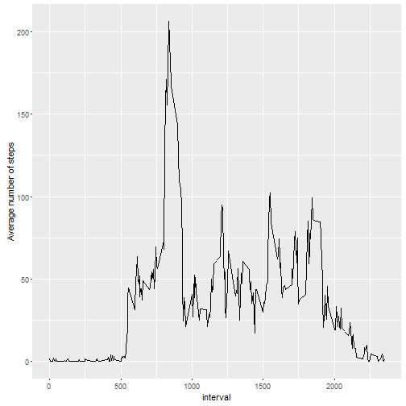
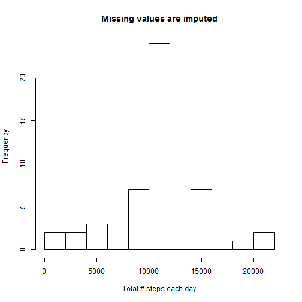
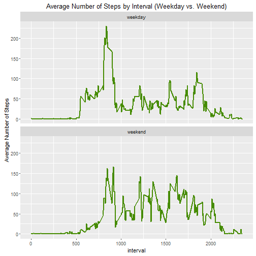

## Background

It is now possible to collect a large amount of data about personal movement using activity monitoring devices such as a Fitbit, Nike Fuelband, or Jawbone Up. These type of devices are part of the "quantified self" movement - a group of enthusiasts who take measurements about themselves regularly to improve their health, to find patterns in their behavior, or because they are tech geeks. But these data remain under-utilized both because the raw data are hard to obtain and there is a lack of statistical methods and software for processing and interpreting the data.
This assignment makes use of data from a personal activity monitoring device. This device collects data at 5 minute intervals through out the day. The data consists of two months of data from an anonymous individual collected during the months of October and November, 2012 and include the number of steps taken in 5 minute intervals each day.

The data was downloaded from here: 

- **Dataset**: [Activity monitoring data](https://d396qusza40orc.cloudfront.net/repdata%2Fdata%2Factivity.zip)

The variables included in this dataset are:

-	**steps**: Number of steps taking in a 5-minute interval (missing values are coded as NA)
-	**date**: The date on which the measurement was taken in YYYY-MM-DD format
-	**interval**: Identifier for the 5-minute interval in which measurement was taken

The dataset is stored in a comma-separated-value (CSV) file and there are a total of 17,568 observations in this dataset.

## Loading and preprocessing the data

### 1.	Load the data

Below code load the data directly from the URL, for the purpose of reproducibility.


```r
temp <- tempfile()
download.file("https://d396qusza40orc.cloudfront.net/repdata%2Fdata%2Factivity.zip",temp)
data <- read.csv(unz(temp, "activity.csv"))
unlink(temp)
```

### 2.	Process/transform the data

Below shows the structure of the data. Note that there are 2304 missing values in "steps" variable. 


```r
str(data)
```

```
## 'data.frame':	17568 obs. of  3 variables:
##  $ steps   : int  NA NA NA NA NA NA NA NA NA NA ...
##  $ date    : Factor w/ 61 levels "2012-10-01","2012-10-02",..: 1 1 1 1 1 1 1 1 1 1 ...
##  $ interval: int  0 5 10 15 20 25 30 35 40 45 ...
```

```r
kable(summary(data))
```


|   |    steps      |        date     |   interval    |
|:--|:--------------|:----------------|:--------------|
|   |Min.   :  0.00 |2012-10-01:  288 |Min.   :   0.0 |
|   |1st Qu.:  0.00 |2012-10-02:  288 |1st Qu.: 588.8 |
|   |Median :  0.00 |2012-10-03:  288 |Median :1177.5 |
|   |Mean   : 37.38 |2012-10-04:  288 |Mean   :1177.5 |
|   |3rd Qu.: 12.00 |2012-10-05:  288 |3rd Qu.:1766.2 |
|   |Max.   :806.00 |2012-10-06:  288 |Max.   :2355.0 |
|   |NA's   :2304   |(Other)   :15840 |NA             |

The variable "date" is a factor variable, and we want to change it to date variable.


```r
data$date <- as.Date(data$date)
```

The below basically summarizes the percentage of missing values in "steps" in each day. According to the output, 53 days have no missing value in "steps", and 8 days have 100% missing value in "steps". 


```r
table(with(data, tapply(steps, date, function(x) {sum(is.na(x))/length(x)} ) ) )
```

```
## 
##  0  1 
## 53  8
```

## What is mean total number of steps taken per day?

For this part, missing values in the dataset will be ignored. 

### 1.	Calculate the total number of steps taken per day

First calculate the total number of steps taken per day and store the data.


```r
total.steps.byday <- summarise(group_by(data, date), total.steps = sum(steps, na.rm = T), percent.na = sum(is.na(steps))/length(steps))
```

Below shows total steps and percent of missing values for first 6 days, and the days with missing values. Note that again there are 8 days with missing data, it is all 100% missing, and the total steps is interpreted as 0. I think it is better to exclude these 8 days of data, compared to using 0 for these days.


```r
kable(head(total.steps.byday))
```


|date       | total.steps| percent.na|
|:----------|-----------:|----------:|
|2012-10-01 |           0|          1|
|2012-10-02 |         126|          0|
|2012-10-03 |       11352|          0|
|2012-10-04 |       12116|          0|
|2012-10-05 |       13294|          0|
|2012-10-06 |       15420|          0|

```r
kable(total.steps.byday[total.steps.byday$percent.na > 0, ])
```


|date       | total.steps| percent.na|
|:----------|-----------:|----------:|
|2012-10-01 |           0|          1|
|2012-10-08 |           0|          1|
|2012-11-01 |           0|          1|
|2012-11-04 |           0|          1|
|2012-11-09 |           0|          1|
|2012-11-10 |           0|          1|
|2012-11-14 |           0|          1|
|2012-11-30 |           0|          1|

### 2.	Make a histogram of the total number of steps taken each day

Now make a histogram of the total number of steps taken each day, excluding those 8 days with missing data. 


```r
total.steps.rm.na <- total.steps.byday$total.steps[total.steps.byday$percent.na == 0]
hist(total.steps.rm.na, breaks = 10, main = 'Missing values are omitted', xlab = 'Total # steps each day')
```



### 3.	Calculate and report the mean and median of the total number of steps taken per day

Now calculate and report the mean and median of the total number of steps taken per day, excluding those 8 days with missing data. The mean and median are very close to each other.


```r
cat('Mean of total number of steps taken per day:', mean(total.steps.rm.na))
```

```
## Mean of total number of steps taken per day: 10766.19
```

```r
cat('Median of total number of steps taken per day:', median(total.steps.rm.na))
```

```
## Median of total number of steps taken per day: 10765
```

## What is the average daily activity pattern?

### 1.	Make a time series plot (i.e. type = "l") of the 5-minute interval (x-axis) and the average number of steps taken, averaged across all days (y-axis)


First generate the data of average number of steps of the 5-minute interval and store it.

```r
mean.steps.byinterval <- summarise(group_by(data, interval), mean.steps = mean(steps, na.rm = T), percent.na = sum(is.na(steps))/length(steps))
```

Now create a time series plot to show average number of steps by interval.


```r
ggplot(mean.steps.byinterval, aes(interval, mean.steps)) + geom_line() + ylab('Average number of steps')
```



### 2.	Which 5-minute interval, on average across all the days in the dataset, contains the maximum number of steps?

Below prints out the 5-minute interval with the maximum number of steps on average. It turns out the interval 835 has the maximum number of steps on average, which is 206 steps.


```r
kable(mean.steps.byinterval[mean.steps.byinterval$mean.steps == max(mean.steps.byinterval$mean.steps), c(1,2)])
```


| interval| mean.steps|
|--------:|----------:|
|      835|   206.1698|

## Imputing missing values

As mentioned, 8 days have 100% missing value in number of steps. Previously we omitted the missing values. In the section, we try to impute the missing values.

### 1.	Calculate and report the total number of missing values in the dataset (i.e. the total number of rows with NAs)

Below shows number of NAs in each variable. "steps" has 2304 NAs, while the other two variables do not have NAs. Hence total number of rows with NAs is 2304.


```r
c(NA.steps = sum(is.na(data$steps)), NA.date = sum(is.na(data$date)), NA.interval = sum(is.na(data$interval)))
```

```
##    NA.steps     NA.date NA.interval 
##        2304           0           0
```

### 2.	Devise a strategy for filling in all of the missing values in the dataset. The strategy does not need to be sophisticated. For example, you could use the mean/median for that day, or the mean for that 5-minute interval, etc.

Since the pattern of NAs is such that the whole day's data is missing for 8 days, for each day each interval, we can use the mean of all values in that interval to impute the data. Below code create the mean for each interval.


```r
mean.steps.byinterval <- summarise(group_by(data, interval), mean.steps = mean(steps, na.rm = T))
```

### 3.	Create a new dataset that is equal to the original dataset but with the missing data filled in.

Below code create a new dataset with missing data filled in.


```r
imputed <- merge(data, mean.steps.byinterval, by = 'interval', all.x = T)
imputed[is.na(imputed$steps), ]$steps <- imputed[is.na(imputed$steps), ]$mean.steps
imputed <- imputed[order(imputed$date, imputed$interval), -4]
```

### 4.	Make a histogram of the total number of steps taken each day and Calculate and report the mean and median total number of steps taken per day. Do these values differ from the estimates from the first part of the assignment? What is the impact of imputing missing data on the estimates of the total daily number of steps?

Now make a histogram of the total number of steps taken each day. Note that the middle bar is higher than before, which is due to missing values got imputed with mean.


```r
total.steps.byday.imp <- summarise(group_by(imputed, date), total.steps = sum(steps))
hist(total.steps.byday.imp$total.steps, breaks = 10, main = 'Missing values are imputed', xlab = 'Total # steps each day')
```



Now calculate the mean and median total number of steps taken per day. The mean is same as before, and the median is slightly different from before. Actually now the median is same as the mean.


```r
cat('Mean of total number of steps taken per day:', mean(total.steps.byday.imp$total.steps))
```

```
## Mean of total number of steps taken per day: 10766.19
```

```r
cat('Median of total number of steps taken per day:', median(total.steps.byday.imp$total.steps))
```

```
## Median of total number of steps taken per day: 10766.19
```

Since we impute missing values with mean values, the total daily number of steps are more distributed around the mean, which also bring the mean and median together.

## Are there differences in activity patterns between weekdays and weekends?

For this part the weekdays() function may be of some help here. Use the dataset with the filled-in missing values for this part.

### 1.	Create a new factor variable in the dataset with two levels - "weekday" and "weekend" indicating whether a given date is a weekday or weekend day.

Below code creates a new factor variable in the dataset with two levels - "weekday" and "weekend" indicating whether a given date is a weekday or weekend day.


```r
imputed$wkd <- ifelse(weekdays(imputed$date) %in% c('Saturday', 'Sunday'), 'weekend', 'weekday')
```

### 2.	Make a panel plot containing a time series plot (i.e. type = "l") of the 5-minute interval (x-axis) and the average number of steps taken, averaged across all weekday days or weekend days (y-axis). See the README file in the GitHub repository to see an example of what this plot should look like using simulated data.

First create the data of average number of steps by interval, for weekday days or weekend days separately.


```r
mean.steps.interval.wkd <-
  {
    imputed %>%
      group_by(interval, wkd) %>%
        summarize(mean.steps = mean(steps))
  }
```

Now plot the average number of steps by interval, for weekday days or weekend days separately.


```r
ggplot(mean.steps.interval.wkd, aes(interval, mean.steps)) + 
  geom_line(color = 'chartreuse4', lwd = 1) + 
  facet_wrap( ~ wkd, ncol = 1) +
  labs(y = 'Average Number of Steps', title = "Average Number of Steps by Interval (Weekday vs. Weekend)")
```



We can see that the average number of steps over interval has similar patterns for weekdays and weekends.


